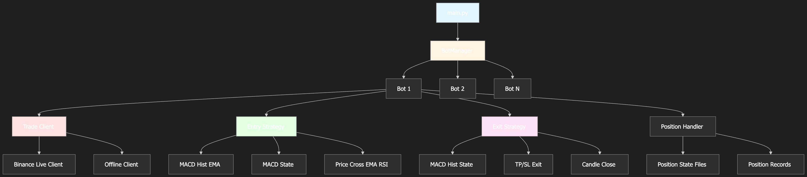

# Binance Futures Trading Bot

A configurable Binance Futures trading framework for running multiple bots in parallel with shared execution flow, pluggable strategies, live trading, and backtesting support.

## Overview

This repository is built around a **shared bot lifecycle**:

- `main.py` starts the system
- `BotManager` loads enabled bot configs and runs each bot in its own thread
- each `Bot` uses the same execution flow
- strategy modules vary signal logic
- trade client modules vary execution backend
- `PositionHandler` persists local position state and trade history

This design keeps the execution model consistent across bots while still allowing different strategies, order types, and run modes.

## Key Features

- Multi-bot execution with one thread per bot
- Shared and consistent bot lifecycle
- Pluggable entry and exit strategies
- Live trading through Binance Futures REST API
- Backtest mode using a simulated Binance-compatible client
- Support for `MARKET`, `LIMIT`, and `MAKER_ONLY` order flows
- TP/SL order placement and monitoring
- Position state persistence and recovery after restart
- Backtest result generation and export
- Optional Google Sheets integration for trade records

## Supported Modes

### Live mode
Uses the Binance live trade client to:
- fetch klines and price data
- fetch active positions
- place and cancel orders
- manage leverage
- place and monitor TP/SL algorithmic orders

### Backtest mode
Uses the Binance backtest trade client to:
- preload historical Binance klines
- simulate order execution
- simulate TP/SL triggers
- calculate fees and PnL
- advance candle-by-candle through historical data
- save summarized backtest results

## High-Level Architecture

```text
main.py
  -> BotManager
      -> bot_config_loader
          -> BotConfig
      -> Bot (one per config, each in its own thread)
          -> PositionHandler
          -> get_trade_client()
              -> BinanceLiveTradeClient | BinanceBacktestTradeClient | OfflineLiveTradeClient
          -> get_strategy()
              -> EntryStrategy
              -> ExitStrategy
```



## Core Modules

### `main.py`
System entry point.

Responsibilities:
- parse optional CLI bot IDs
- initialize `BotManager`
- run all enabled bots or only selected bots

### `core/bot_manager.py`
Multi-bot orchestrator.

Responsibilities:
- load bot config files from `config/`
- validate and create bot instances
- run each bot in a separate thread
- wait for all bot threads to finish

### `core/bot.py`
Main trading lifecycle engine.

Responsibilities:
- initialize trade client and strategies
- set leverage
- fetch and cache exchange info
- execute bot loop
- fetch market data
- sync remote position with local state
- evaluate entry and exit conditions
- place open and close orders
- place and monitor TP/SL orders
- persist state
- generate backtest metrics in backtest mode

### `core/position_handler.py`
Local position state manager.

Responsibilities:
- restore previous position state from disk
- open and close local positions
- track current TP/SL metadata
- update current/max/min PnL
- save current state to `position_states/`
- save closed trades to `position_records/`

### `core/bot_config_loader.py`
Configuration loader.

Responsibilities:
- load all enabled bot configs
- load selected bot configs by ID
- validate JSON config structure
- convert configs into `BotConfig`

### `models/`
Typed runtime models.

Important models:
- `models/bot_config.py`
- `models/position.py`
- `models/position_signal.py`

### `strategies/`
Strategy layer.

Responsibilities:
- process klines
- calculate indicators
- generate entry signals
- generate exit signals
- calculate TP/SL values

### `trade_clients/`
Execution backend layer.

Responsibilities:
- abstract exchange operations through `BaseTradeClient`
- provide live Binance implementation
- provide backtest Binance-compatible implementation
- provide minimal offline testing client

### `commons/`
Shared utilities and constants.

Includes:
- logger
- constants
- config validation
- fee calculation
- common time/date helpers

### `standalone_services/`
Utility scripts outside the main bot loop.

Includes:
- Google Sheets sync for trade records
- backtest result visualization

## Strategy Layer

Strategies are loaded through `strategies/get_strategy.py` using a registry and dynamic imports.

### Entry strategies
Current registered entry strategies include:
- `MACD_STATE`
- `MACDHIST_STATE`
- `MACDHIST_EMA_V1`
- `PRICE_CROSS_EMA_RSI`
- `PREVIOUS_CANDLE`
- `MOMENTUM_TREND_FILTERED`

Entry strategies must implement:
- `_process_data(klines_df)`
- `should_open(klines_df, position_handler)`
- `calculate_tp_sl(klines_df, position_side, entry_price)`

### Exit strategies
Current registered exit strategies include:
- `MACD_STATE`
- `MACDHIST_STATE`
- `TP_SL`
- `CANDLE_CLOSE`

Exit strategies must implement:
- `_process_data(klines_df)`
- `should_close(klines_df, position_handler)`

## Trade Client Layer

Trade clients are loaded through `trade_clients/get_trade_client.py`.

### Binance live client
File: `trade_clients/binance/binance_live_trade_client.py`

Capabilities:
- authenticated Binance Futures REST calls
- leverage configuration
- position fetch
- price fetch
- kline fetch
- order placement and cancellation
- TP/SL algorithmic order placement and monitoring
- order book fetch
- exchange info caching

### Binance backtest client
File: `trade_clients/binance/binance_backtest_trade_client.py`

Capabilities:
- preload historical candles from Binance
- simulate positions
- simulate standard orders
- simulate TP/SL triggers on future candles
- calculate fees and PnL
- serve rolling kline windows to the bot
- maintain exchange info cache

### Offline live client
File: `trade_clients/offline/offline_live_client.py`

Capabilities:
- load mock klines from `resources/mock_klines.json`

Note:
- this client is minimal and appears intended for lightweight testing/development

## Execution Flow

The shared `Bot.execute()` lifecycle is state-based.

### State 1: No position, no TP/SL
- fetch klines
- fetch remote position
- sync local and remote state
- run entry strategy
- if strategy returns `LONG` or `SHORT`, open a new position
- optionally place TP/SL orders

### State 2: TP/SL monitoring
- if TP/SL exists but no remote position is active, check whether TP or SL was triggered
- fetch final trade details
- finalize local trade record
- clear TP/SL state

### State 3: Active position
- update current PnL from remote position
- run exit strategy
- if strategy signals close, place a close order
- finalize trade
- clear TP/SL state

### Loop behavior
- in live mode: wait with jitter between iterations
- in backtest mode: advance one candle per loop
- on backtest completion: print and save results

## Order Execution Modes

### Market
- place order immediately
- poll until filled
- fetch trade details from exchange/client

### Limit
- place order at current fetched price
- monitor price changes
- cancel and replace if price moves before fill
- continue until filled

### Maker-only
- fetch order book
- calculate maker-safe price from bid/ask and tick size
- place a post-only limit order using `GTX`
- reprice and retry if needed
- continue until filled

## Data Flow

### Configuration flow
1. `main.py` reads CLI arguments
2. `BotManager` loads config JSON files
3. raw JSON is validated and converted into `BotConfig`
4. one `Bot` is created per valid config

### Runtime flow
1. bot fetches klines from the trade client
2. bot fetches current remote position
3. bot syncs local position state with remote state
4. strategy processes klines and returns a `PositionSignal`
5. bot places orders through the trade client
6. `PositionHandler` updates local state and persistence
7. backtest metrics are updated when in backtest mode

### Persistence flow
- open positions are stored in `position_states/`
- closed trades are stored in `position_records/`
- backtest summaries are stored in `backtest/results/`

## External Dependencies

### Exchange/API
Primary external dependency:
- Binance USDT-M Futures REST API

Used for:
- leverage
- positions
- orders
- algorithmic TP/SL orders
- user trades
- klines
- ticker price
- order book
- exchange info

### Credentials
Environment variables used:
- `BINANCE_API_KEY`
- `BINANCE_SECRET_KEY`

Optional:
- Google Sheets service account file and spreadsheet key

### Storage
This project does not use a relational database.

Persistence is file-based:
- `config/*.json`
- `position_states/`
- `position_records/`
- `backtest/results/`

## Configuration

Each bot has its own config file in `config/`, typically named:

```text
config/bot_1.json
config/bot_2.json
...
```

Example:

```json
{
  "is_enabled": false,
  "bot_id": 27,
  "run_id": 27,
  "bot_name": "Momentum Trend Filtered - SOLUSDT 1h",
  "run_mode": "live",
  "trade_client": "binance",
  "entry_strategy": "momentum_trend_filtered",
  "exit_strategy": "tp_sl",
  "tp_enabled": true,
  "sl_enabled": true,
  "symbol": "SOLUSDT",
  "leverage": 5,
  "quantity": 0.5,
  "timeframe": "1h",
  "timeframe_limit": 500,
  "order_type": "LIMIT",
  "dynamic_config": {
    "min_body_pct": 0.008,
    "sl_buffer": 0.002,
    "ema_period": 200,
    "atr_period": 14,
    "atr_ma_period": 20,
    "atr_threshold_multiplier": 0.9
  },
  "created_at": "2026-03-07T13:30:00"
}
```

### Important config fields

- `is_enabled`: whether the bot should run
- `bot_id`: bot identifier
- `run_id`: used in persistence filenames
- `bot_name`: display name
- `run_mode`: `live` or `backtest`
- `trade_client`: `binance` or `offline`
- `entry_strategy`: entry strategy enum value
- `exit_strategy`: exit strategy enum value
- `tp_enabled`: enable TP placement
- `sl_enabled`: enable SL placement
- `symbol`: trading symbol such as `BTCUSDT` or `SOLUSDT`
- `leverage`: futures leverage
- `quantity`: order size
- `timeframe`: candle interval
- `timeframe_limit`: number of candles to fetch
- `order_type`: `MARKET`, `LIMIT`, or `MAKER_ONLY`
- `dynamic_config`: strategy-specific parameters

See:
- `config/_example_bots_config.json`
- `config/bot_*.json`

## Position Persistence

### `position_states/`
Current open position snapshots.

Characteristics:
- one state file per `run_id`
- used for restart recovery
- removed when the position closes

### `position_records/`
Closed trade history.

Characteristics:
- one file per closed position
- includes entry/exit prices, fees, pnl, reasons, timestamps

### `backtest/results/`
Backtest outputs.

Characteristics:
- saved after backtest completion
- includes summary metrics and configuration snapshot


## One-Page ASCII Architecture Diagram

```text
BINANCE API TRADING BOT - ONE-PAGE ASCII ARCHITECTURE
=====================================================

                                    +----------------------+
                                    |      main.py         |
                                    |----------------------|
                                    | parse CLI bot IDs    |
                                    | create BotManager    |
                                    | start manager.run()  |
                                    +----------+-----------+
                                               |
                                               v
                                    +----------------------+
                                    |   core/bot_manager   |
                                    |----------------------|
                                    | load bot configs     |
                                    | validate configs     |
                                    | create Bot objects   |
                                    | run each in thread   |
                                    +-----+-----------+----+
                                          |           |
                                          |           +----------------------+
                                          |                                  |
                                          v                                  v
                            +---------------------------+          +----------------------+
                            | core/bot_config_loader    |          |   Bot thread #N      |
                            |---------------------------|          |   core/bot.py        |
                            | load bot_*.json files     |          +----------------------+
                            | filter enabled / by IDs   |
                            | parse + validate JSON     |                    ^
                            +-------------+-------------+                    |
                                          |                                  |
                                          v                                  |
                            +---------------------------+                    |
                            |    models/BotConfig       |--------------------+
                            |---------------------------|
                            | typed runtime config      |
                            | enums + dynamic_config    |
                            +---------------------------+


BOT CORE (core/bot.py)
======================

+--------------------------------------------------------------------------------------+
| Bot                                                                                  |
|--------------------------------------------------------------------------------------|
| Init:                                                                                |
|  - PositionHandler(bot_config)                                                       |
|  - get_trade_client(run_mode, trade_client)                                          |
|  - set_leverage(symbol, leverage)                                                    |
|  - fetch_exchange_info(symbol) -> cache tick/step rules                              |
|  - init_strategies(entry_strategy, exit_strategy, dynamic_config)                    |
|  - if BACKTEST: preload_historical_data() + BacktestMetrics                          |
|                                                                                      |
| Loop: run()                                                                          |
|  - execute()                                                                         |
|  - LIVE: trade_client.wait()                                                         |
|  - BACKTEST: advance_candle()                                                        |
+--------------------------------------------------------------------------------------+


RUNTIME DECISION FLOW
=====================

                         +----------------------------------+
                         | execute()                        |
                         |----------------------------------|
                         | fetch_klines()                   |
                         | fetch_position()                 |
                         | sync local vs remote state       |
                         +----------------+-----------------+
                                          |
                 +------------------------+-------------------------+
                 |                        |                         |
                 v                        v                         v
       +------------------+    +-----------------------+   +----------------------+
       | STATE 1          |    | STATE 2               |   | STATE 3              |
       | no position      |    | TP/SL orders exist    |   | active position      |
       | no TP/SL orders  |    | no remote position    |   | exists               |
       +--------+---------+    +-----------+-----------+   +----------+-----------+
                |                          |                          |
                v                          v                          v
       +------------------+      +----------------------+    +----------------------+
       | Entry strategy   |      | monitor TP/SL fills  |    | Exit strategy        |
       | should_open()    |      | fetch_algorithmic... |    | should_close()       |
       +--------+---------+      +-----------+----------+    +----------+-----------+
                |                            |                          |
      signal LONG/SHORT?                     | hit?                     | return ZERO?
                |                            |                          |
          +-----+-----+                      |                          |
          |           |                      |                          |
         no          yes                     |                         no
          |           |                      |                          |
          |           v                      v                          |
          |   +------------------+   +--------------------+             |
          |   | open position    |   | close local trade  |             |
          |   | market/limit/    |   | record pnl/fees    |             |
          |   | maker-only       |   | clear TP/SL ids    |             |
          |   +--------+---------+   +--------------------+             |
          |            |                                                   |
          |            v                                                   |
          |   +----------------------+                                     |
          |   | place TP/SL orders?  |                                     |
          |   | calculate_tp_sl()    |                                     |
          |   +----------------------+                                     |
          |                                                                   |
          +-------------------------------------------------------------------+
                                                                              |
                                                                              v
                                                                  +----------------------+
                                                                  | close position order |
                                                                  | market/limit/maker   |
                                                                  +----------+-----------+
                                                                             |
                                                                             v
                                                                  +----------------------+
                                                                  | finalize trade       |
                                                                  | record pnl/fees      |
                                                                  | clear TP/SL ids      |
                                                                  +----------------------+


STRATEGY LAYER
==============

                 +-----------------------------------------------+
                 | strategies/get_strategy.py                    |
                 |-----------------------------------------------|
                 | registry + dynamic imports                    |
                 | maps enums -> concrete strategy classes       |
                 +------------------+----------------------------+
                                    |
                 +------------------+------------------+
                 |                                     |
                 v                                     v
   +-------------------------------+      +-------------------------------+
   | Entry strategies              |      | Exit strategies               |
   |-------------------------------|      |-------------------------------|
   | entry_macd_state              |      | exit_macd_state               |
   | entry_macdhist_state          |      | exit_macdhist_state           |
   | entry_macdhist_ema_v1         |      | exit_candle_close             |
   | entry_previous_candle         |      | exit_tp_sl                    |
   | entry_price_cross_ema_rsi     |      +-------------------------------+
   | entry_momentum_trend_filtered |
   +-------------------------------+

Contracts:
- Entry: should_open(df, position_handler) -> PositionSignal
- Entry: calculate_tp_sl(df, side, entry_price) -> (tp_price, sl_price)
- Exit : should_close(df, position_handler) -> PositionSignal

Signal object:
+---------------------------+
| models/position_signal.py |
|---------------------------|
| position_side             |
| reason                    |
+---------------------------+


TRADE CLIENT LAYER
==================

                    +-----------------------------------------+
                    | trade_clients/get_trade_client.py       |
                    |-----------------------------------------|
                    | registry by (TradeClient, RunMode)      |
                    +------------------+----------------------+
                                       |
             +-------------------------+--------------------------+
             |                                                    |
             v                                                    v
+--------------------------------------+         +--------------------------------------+
| BinanceLiveTradeClient               |         | BinanceBacktestTradeClient           |
|--------------------------------------|         |--------------------------------------|
| real Binance Futures REST adapter    |         | simulated Binance-compatible client  |
|                                      |         |                                      |
| fetch_klines()                       |         | preload_historical_data()            |
| fetch_price()                        |         | fetch_klines() from cache            |
| fetch_position()                     |         | fetch_position() simulated           |
| place_order()                        |         | place_order() immediate simulated    |
| fetch_order()                        |         | fetch_order() always FILLED          |
| cancel_order()                       |         | place/fetch/cancel algo orders       |
| place/fetch/cancel algo order        |         | auto-trigger TP/SL by candle range   |
| fetch_trades()/fetch_order_trade()   |         | calculate fee + pnl                  |
| fetch_order_book()                   |         | fetch_order_book() synthetic         |
| fetch_exchange_info() + cache        |         | fetch_exchange_info() + cache        |
+-------------------+------------------+         +-------------------+------------------+
                    |                                                    |
                    v                                                    v
         +---------------------------+                        +---------------------------+
         | Binance Futures REST API  |                        | Historical Binance klines |
         +---------------------------+                        +---------------------------+

Also present:
+--------------------------------------+
| OfflineLiveTradeClient               |
|--------------------------------------|
| reads resources/mock_klines.json     |
| minimal testing/dev client           |
+--------------------------------------+


LOCAL STATE + PERSISTENCE
=========================

     +-----------------------------------+
     | core/position_handler.py          |
     |-----------------------------------|
     | restore state on startup          |
     | open_position()                   |
     | close_position()                  |
     | update_pnl(), max_pnl, min_pnl    |
     | track tp/sl order ids + prices    |
     | dump/remove state files           |
     +-----------+---------------+-------+
                 |               |
                 |               |
                 v               v
      +-------------------+   +---------------------+
      | position_states/  |   | position_records/   |
      |-------------------|   |---------------------|
      | current open pos  |   | archived closed     |
      | per run_id        |   | trades per run_id   |
      +-------------------+   +---------------------+

     +---------------------------+
     | models/position.py        |
     |---------------------------|
     | symbol, side, entry/exit  |
     | open/close reason         |
     | fees, pnl, max/min pnl    |
     +---------------------------+


EXTERNAL DEPENDENCIES
=====================

+-------------------------------------------------------------+
| Binance Futures REST API                                    |
| - leverage, positions, orders, algo orders, trades          |
| - klines, ticker price, order book, exchange info           |
+-------------------------------------------------------------+

+-------------------------------------------------------------+
| Environment variables (.env)                                |
| - BINANCE_API_KEY                                           |
| - BINANCE_SECRET_KEY                                        |
| - optional Google Sheets credentials                        |
+-------------------------------------------------------------+

+-------------------------------------------------------------+
| File-based persistence                                      |
| - config/*.json                                             |
| - position_states/                                          |
| - position_records/                                         |
| - backtest/results/                                         |
+-------------------------------------------------------------+

+-------------------------------------------------------------+
| Optional reporting / utilities                              |
| - gspread / google-auth                                     |
| - standalone_services/update_position_record_to_google...   |
| - standalone_services/visualize_backtest_result.py          |
+-------------------------------------------------------------+


END-TO-END FLOW SUMMARY
=======================

config JSON
   -> BotConfig
   -> BotManager
   -> Bot thread
   -> trade client + strategies initialized
   -> klines fetched
   -> strategy emits PositionSignal
   -> Bot places open order
   -> PositionHandler stores local state
   -> optional TP/SL algo orders placed
   -> each loop: sync remote/local, monitor TP/SL, or run exit strategy
   -> close order executed
   -> fees/pnl recorded
   -> position record saved
   -> if backtest: metrics summarized to backtest/results
```

## Installation

### Prerequisites
- Python 3.8+
- Binance account with Futures enabled
- Binance API key and secret key

### Install dependencies

```bash
python3 -m venv .venv
source .venv/bin/activate
python3 -m pip install -r requirements.txt
```

## Environment Setup

Create `.env` from `.env.example`.

Example:

```bash
# Binance API Credentials
BINANCE_API_KEY=your_api_key_here
BINANCE_SECRET_KEY=your_secret_key_here

# Google Sheet Integration (Optional)
GOOGLE_SHEET_SERVICE_ACCOUNT_FILE=_private_binance-trading-logger-cred.json
GOOGLE_SHEET_SPREADSHEET_KEY=your_spreadsheet_key

# Logging Configuration
LOG_LEVELS=INFO
```

## Running the Bot

Run all enabled bots:

```bash
python3 main.py
```

Run specific bot IDs:

```bash
python3 main.py 1
python3 main.py 1 27
```

Or use the helper script:

```bash
./start_bot_services.sh
```

## Example Backtest Flow

A backtest bot:
- loads historical klines through the Binance backtest client
- starts from `candle_for_indicator - 1`
- advances one candle each iteration
- simulates orders and TP/SL behavior
- writes summary output to `backtest/results/`

## Notes and Limitations

- current TP/SL support is centered around one TP and one SL per position
- a multi-TP extension is a recommended future improvement
- the offline live client is minimal and not a full-featured exchange simulator
- persistence is file-based, not database-backed
- risk management remains the user’s responsibility

## Risk Warning

Cryptocurrency futures trading is high risk.

You should:
- test in backtest mode first
- start with small size and low leverage
- validate configs carefully
- monitor live bots closely
- understand Binance Futures behavior and API limits

## Useful Files

- `main.py`
- `core/bot.py`
- `core/bot_manager.py`
- `core/position_handler.py`
- `core/backtest_metrics.py`
- `strategies/get_strategy.py`
- `trade_clients/get_trade_client.py`
- `config/_example_bots_config.json`
- `.env.example`

## API Reference

- [Binance Futures API Documentation](https://developers.binance.com/docs/derivatives/Introduction)