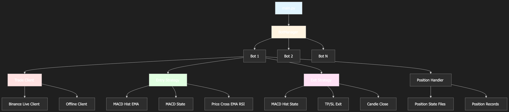

# Binance Futures Trading Bot

A configurable Binance Futures trading framework for running multiple bots in parallel with shared execution flow, pluggable strategies, live trading, and backtesting support.

## Overview

This repository is built around a **shared bot lifecycle**:

- `main.py` starts the system
- `BotManager` loads enabled bot configs and runs each bot in its own thread
- each `Bot` uses the same execution flow
- strategy modules vary signal logic
- `TradeHandler` owns order placement, sizing, and TP/SL mechanics
- trade client modules vary execution backend
- `PositionHandler` persists local position state, cooldowns, and trade history

This design keeps the execution model consistent across bots while still allowing different strategies, order types, and run modes.

## Key Features

- Multi-bot execution with one thread per bot
- Shared and consistent bot lifecycle
- Pluggable entry and exit strategies
- Live trading through Binance Futures REST API
- Backtest mode using a simulated Binance-compatible client
- Support for `MARKET`, `LIMIT`, and `MAKER_ONLY` order flows
- Fixed-margin position sizing (`position_margin`) or legacy fixed quantity
- TP/SL order placement and monitoring
- Re-entry cooldowns after stop loss or strategy-defined exit conditions
- Position state persistence and recovery after restart
- Backtest result generation and export
- Optional Google Sheets integration for trade records
- Standalone utilities for kline capture and manual position closing

## Supported Modes

### Live mode
Uses the Binance live trade client to:
- fetch klines and price data
- fetch active positions
- place and cancel orders
- manage leverage
- place and monitor TP/SL algorithmic orders

### Backtest mode
Uses the Binance backtest trade client to:
- preload historical Binance klines
- simulate order execution
- simulate TP/SL triggers
- calculate fees and PnL
- advance candle-by-candle through historical data
- save summarized backtest results

## High-Level Architecture

```text
main.py
  -> BotManager
      -> bot_config_loader
          -> BotConfig
      -> Bot (one per config, each in its own thread)
          -> PositionHandler
          -> get_trade_client()
              -> BinanceLiveTradeClient | BinanceBacktestTradeClient | OfflineLiveTradeClient
          -> TradeHandler
              -> position sizing, order placement, TP/SL orders
          -> get_strategy()
              -> EntryStrategy
              -> ExitStrategy
```



## Core Modules

### `main.py`
System entry point.

Responsibilities:
- parse optional CLI bot IDs
- initialize `BotManager`
- run all enabled bots or only selected bots

### `core/bot_manager.py`
Multi-bot orchestrator.

Responsibilities:
- load bot config files from `config/`
- validate and create bot instances
- run each bot in a separate thread
- wait for all bot threads to finish

### `core/bot.py`
Main trading lifecycle engine and state machine.

Responsibilities:
- initialize trade client, trade handler, and strategies
- set leverage
- fetch and cache exchange info
- execute bot loop
- fetch market data
- sync remote position with local state
- evaluate entry and exit conditions
- delegate order placement to `TradeHandler`
- apply cooldowns after SL hits and strategy-defined exits
- persist state
- generate backtest metrics in backtest mode

Order mechanics live in `TradeHandler`, so `Bot` stays a thin decision layer.

### `core/trade_handler.py`
Order execution and sizing engine.

Responsibilities:
- resolve trade quantity from `quantity` or `position_margin`
- round prices to exchange tick size
- calculate maker-safe prices from the order book
- place `MARKET`, `LIMIT`, and `MAKER_ONLY` orders
- place, cancel, and monitor TP/SL algorithmic orders
- open and close positions and return fill details

### `core/position_handler.py`
Local position and cooldown state manager.

Responsibilities:
- restore previous position state from disk
- open and close local positions
- track current TP/SL metadata
- update current/max/min PnL
- track last known price and last open/close candle
- set, check, and clear re-entry cooldowns
- save current state to `position_states/`
- save closed trades to `position_records/`

### `core/bot_config_loader.py`
Configuration loader.

Responsibilities:
- load all enabled bot configs
- load selected bot configs by ID
- validate JSON config structure
- convert configs into `BotConfig`

### `models/`
Typed runtime models.

Important models:
- `models/bot_config.py`
- `models/position.py`
- `models/position_signal.py`
- `models/enum/` (run mode, order type, position side, strategy enums)

### `abstracts/`
Abstract base classes defining the plug-in contracts.

Includes:
- `base_entry_strategy.py`
- `base_exit_strategy.py`
- `base_trade_client.py`
- `base_live_trade_client.py`
- `base_backtest_trade_client.py`

### `strategies/`
Strategy layer.

Responsibilities:
- process klines
- calculate indicators
- generate entry signals
- generate exit signals
- calculate TP/SL values
- declare post-close cooldown durations

`strategies/data_processor.py` holds shared helpers used across strategies:
- `calculate_macd`, `calculate_ema`, `calculate_rsi`, `calculate_atr`
- `resolve_sl_price` (resolves `sl_target_pct` / `sl_target_pnl` into an SL price)

### `trade_clients/`
Execution backend layer.

Responsibilities:
- abstract exchange operations through `BaseTradeClient`
- provide live Binance implementation
- provide backtest Binance-compatible implementation
- provide minimal offline testing client

### `commons/`
Shared utilities and constants.

Includes:
- logger
- constants
- config validation
- fee calculation
- common time/date helpers

### `standalone_services/`
Utility scripts outside the main bot loop.

Includes:
- `update_position_record_to_google_sheet.py` - Google Sheets sync for trade records
- `fetch_binance_klines.py` - fetch klines to CSV without starting a bot
- `record_bot_klines.py` - continuously record the klines a live bot sees, for replay
- `manual_close_position.py` - flatten an open position with a market order
- `bot_utils.py` - helpers for reading and rewriting bot config files

### `backtest/`
Backtest outputs and reporting.

Includes:
- `results/` - saved backtest summaries
- `visualize_backtest_result.py` - renders backtest results

## Strategy Layer

Strategies are loaded through `strategies/get_strategy.py` using a registry and dynamic imports.

Every strategy is constructed with `bot_config` and the bot's logger, so it can read
`dynamic_config`, `leverage`, and `position_margin` directly.

### Entry strategies

| Enum | Module | Idea |
|------|--------|------|
| `MACD_STATE` | `entry_macd_state` | MACD line/signal state |
| `MACDHIST_STATE` | `entry_macdhist_state` | MACD histogram state |
| `MACDHIST_EMA_V1` | `entry_macdhist_ema_v1` | MACD histogram filtered by EMA trend |
| `PRICE_CROSS_EMA_RSI` | `entry_price_cross_ema_rsi` | Price/EMA cross confirmed by RSI |
| `PREVIOUS_CANDLE` | `entry_previous_candle` | Follows the previous candle direction |
| `MOMENTUM_TREND_FILTERED` | `entry_momentum_trend_filtered` | Body momentum filtered by EMA and ATR |
| `WICK_MEAN_REVERSION` | `entry_wick_mean_reversion` | Fades a strong candle when wick filters confirm a ranging market |
| `GUARANTEED_SCALP` | `entry_guaranteed_scalp` | Enters every candle with a small fixed TP for a high win rate |
| `SCALP_BODY_FILTER_MOMENTUM` | `entry_scalp_body_filter_momentum` | Momentum scalp gated on a minimum body percentage |

Entry strategies must implement:
- `_process_data(klines_df)`
- `should_open(klines_df, position_handler)` -> `PositionSignal`
- `calculate_tp_sl(klines_df, position_handler)` -> `(tp_price, sl_price)`

`calculate_tp_sl` runs after the position is open, so it reads the actual fill price
and quantity from `position_handler` rather than receiving them as arguments.

### Exit strategies

| Enum | Module | Idea |
|------|--------|------|
| `TP_SL` | `exit_tp_sl` | Closes when price crosses the stored TP or SL level |
| `MACD_STATE` | `exit_macd_state` | Closes on MACD state flip |
| `MACDHIST_STATE` | `exit_macdhist_state` | Closes on MACD histogram flip |
| `CANDLE_CLOSE` | `exit_candle_close` | Closes at the end of the entry candle |
| `CANDLE_CLOSE_WITH_SL` | `exit_candle_close_with_sl` | Candle close exit plus a price-based SL check |
| `WICK_TARGET` | `exit_wick_target` | Holds for the TP, otherwise exits at candle close |
| `COUNTDOWN` | `exit_countdown` | Force closes after `countdown_minutes` if TP is not hit |
| `COUNTDOWN_WITH_MAX_LOSS` | `exit_countdown_with_max_loss` | Countdown exit plus max-loss protection at the SL level |

Exit strategies must implement:
- `_process_data(klines_df)`
- `should_close(klines_df, position_handler)` -> `PositionSignal`

Exit strategies may optionally override:
- `get_cooldown_seconds(close_reason, pnl)` -> cooldown in seconds (default `0.0`)

A signal of `PositionSide.ZERO` from `should_close` means "close now"; returning the
current side means "hold".

## Trade Client Layer

Trade clients are loaded through `trade_clients/get_trade_client.py`.

### Binance live client
File: `trade_clients/binance/binance_live_trade_client.py`

Capabilities:
- authenticated Binance Futures REST calls
- leverage configuration
- position fetch
- price fetch
- kline fetch
- order placement and cancellation
- TP/SL algorithmic order placement and monitoring
- order book fetch
- exchange info caching

### Binance backtest client
File: `trade_clients/binance/binance_backtest_trade_client.py`

Capabilities:
- preload historical candles from Binance
- simulate positions
- simulate standard orders
- simulate TP/SL triggers on future candles
- calculate fees and PnL
- serve rolling kline windows to the bot
- maintain exchange info cache

### Offline live client
File: `trade_clients/offline/offline_live_client.py`

Capabilities:
- load mock klines from `resources/mock_klines.json`

Note:
- this client is minimal and appears intended for lightweight testing/development

## Execution Flow

The shared `Bot.execute()` lifecycle is state-based.

Each iteration first fetches klines, fetches the remote position, and syncs local with
remote state, then falls into one of three states.

### State 1: No position, no TP/SL
- skip the candle if the bot is in a cooldown period
- run entry strategy
- if strategy returns `LONG` or `SHORT`, open a new position
- always calculate TP/SL prices and store them on the position handler
- place TP/SL orders on the exchange when `tp_enabled` / `sl_enabled`

### State 2: TP/SL monitoring
- if TP/SL exists but no remote position is active, check whether TP or SL was triggered
- fetch final trade details
- finalize local trade record
- start a cooldown when SL filled and `cooldown_after_sl_seconds` is set
- clear TP/SL state

### State 3: Active position
- update current PnL and last known price from the remote position
- reconcile the cached trade quantity with the remote quantity
- run exit strategy
- if strategy signals close, place a close order
- finalize trade
- start a cooldown when the exit strategy asks for one
- clear TP/SL state

### Position sync cases
`_sync_position_state` reconciles local memory against the exchange each iteration:

- no remote position but a local one, TP/SL disabled -> assume liquidation/external close and clear local state
- no remote position and no local one but TP/SL order IDs exist -> likely liquidation; leave it for TP/SL monitoring
- remote position but no local one -> adopt the remote position into local state
- both present but side or entry price differ -> clear local state and resync

### Loop behavior
- in live mode: wait with jitter between iterations
- in backtest mode: advance one candle per loop
- on backtest completion: print and save results

## Order Execution Modes

All three modes are implemented in `core/trade_handler.py`.

### Market
- place order immediately
- poll until filled
- fetch trade details from exchange/client

### Limit
- place order at current fetched price
- monitor price changes
- cancel and replace if price moves before fill
- continue until filled

### Maker-only
- fetch order book
- calculate maker-safe price from bid/ask and tick size
- place a post-only limit order using `GTX`
- reprice and retry if needed
- continue until filled

## Position Sizing

Two modes are supported. If both are present in a config, `position_margin` wins.

### Fixed margin (recommended)
```json
{ "leverage": 10, "position_margin": 5.0 }
```

Quantity is recalculated at entry from the live price:

```text
quantity = (position_margin * leverage) / current_price
```

then rounded down to the symbol's `stepSize`. Margin usage stays constant as price moves.

### Fixed quantity (legacy)
```json
{ "leverage": 10, "quantity": 0.5 }
```

Quantity is constant, so margin usage scales with price - a doubling of price doubles
the margin required.

A config must set at least one of the two; validation fails otherwise.

See `docs/POSITION_MARGIN_SIZING.md` for the full write-up.

## Cooldown System

Cooldowns block new entries for a period after a position closes. State is held in
memory by `PositionHandler` and is not persisted, so a restart clears any active cooldown.

Two sources:

- **SL cooldown** - `cooldown_after_sl_seconds` at the bot config level, applied when
  TP/SL monitoring detects an SL fill
- **Exit strategy cooldown** - the exit strategy's `get_cooldown_seconds(close_reason, pnl)`
  returns a duration, so different exit conditions (and profit vs loss) can cool down
  for different lengths of time

Countdown strategies read their durations from `dynamic_config`, for example
`cooldown_after_close_seconds`, `cooldown_after_countdown_seconds`, and
`cooldown_after_max_loss_seconds`.

While in cooldown, `Bot` logs the remaining time and skips the entry check entirely.

See `docs/COOLDOWN_SYSTEM.md` for the full write-up.

## Data Flow

### Configuration flow
1. `main.py` reads CLI arguments
2. `BotManager` loads config JSON files
3. raw JSON is validated and converted into `BotConfig`
4. one `Bot` is created per valid config

### Runtime flow
1. bot fetches klines from the trade client
2. bot fetches current remote position
3. bot syncs local position state with remote state
4. strategy processes klines and returns a `PositionSignal`
5. `TradeHandler` sizes the trade and places orders through the trade client
6. `PositionHandler` updates local state, cooldowns, and persistence
7. backtest metrics are updated when in backtest mode

### Persistence flow
- open positions are stored in `position_states/`
- closed trades are stored in `position_records/`
- backtest summaries are stored in `backtest/results/`
- per-bot logs are written to `logs/<YYYYMMDD>/bot_<id>.log`
- captured klines are written to `resources/klines/`

## External Dependencies

### Exchange/API
Primary external dependency:
- Binance USDT-M Futures REST API

Used for:
- leverage
- positions
- orders
- algorithmic TP/SL orders
- user trades
- klines
- ticker price
- order book
- exchange info

### Credentials
Environment variables used:
- `BINANCE_API_KEY`
- `BINANCE_SECRET_KEY`

Optional:
- Google Sheets service account file and spreadsheet key

### Storage
This project does not use a relational database.

Persistence is file-based:
- `config/*.json` (active) and `config/archive/*.json` (retired)
- `position_states/`
- `position_records/`
- `backtest/results/`
- `logs/`
- `resources/klines/`

## Configuration

Each bot has its own config file in `config/`, typically named:

```text
config/bot_90.json
config/bot_91.json
...
```

Retired configs are kept in `config/archive/` and are not loaded by `BotManager`.

Example:

```json
{
  "is_enabled": true,
  "bot_id": 90,
  "run_id": 90,
  "bot_name": "bot 90",
  "run_mode": "live",
  "trade_client": "binance",
  "entry_strategy": "WICK_MEAN_REVERSION",
  "exit_strategy": "COUNTDOWN",
  "tp_enabled": true,
  "sl_enabled": true,
  "cooldown_after_sl_seconds": 0,
  "symbol": "BTCUSDC",
  "leverage": 32,
  "position_margin": 25.0,
  "timeframe": "4h",
  "timeframe_limit": 182,
  "order_type": "MAKER_ONLY",
  "dynamic_config": {
    "decimal": 1,
    "min_body_pct": 0.002,
    "max_body_pct": 0.035,
    "support_position_wick_lookback": 0,
    "min_support_position_wick_pct": 0.002,
    "counter_trend_wick_lookback": 0,
    "min_counter_trend_wick_pct": 0.001,
    "training_candles": 180,
    "percentile": 0.45,
    "countdown_minutes": 230,
    "sl_target_pct": 0.0105,
    "cooldown_after_close_seconds": 0
  },
  "created_at": "2026-08-31T00:00:00"
}
```

### Important config fields

- `is_enabled`: whether the bot should run
- `bot_id`: bot identifier
- `run_id`: used in persistence filenames
- `bot_name`: display name
- `run_mode`: `live` or `backtest`
- `trade_client`: `binance` or `offline`
- `entry_strategy`: entry strategy enum value
- `exit_strategy`: exit strategy enum value
- `tp_enabled`: enable TP placement
- `sl_enabled`: enable SL placement
- `symbol`: trading symbol such as `BTCUSDC` or `SOLUSDT`
- `leverage`: futures leverage (1-125)
- `position_margin`: fixed margin per trade in quote currency (recommended)
- `quantity`: fixed order size (legacy; ignored when `position_margin` is set)
- `timeframe`: candle interval
- `timeframe_limit`: number of candles to fetch
- `order_type`: `MARKET`, `LIMIT`, or `MAKER_ONLY`
- `cooldown_after_sl_seconds`: block re-entry for this long after an SL fill
- `dynamic_config`: strategy-specific parameters

### Common `dynamic_config` keys

These are read by the strategy layer rather than by `BotConfig`:

- `decimal`: price rounding precision used when placing TP/SL orders
- `sl_target_pct`: SL distance as a fraction of entry price (preferred)
- `sl_target_pnl`: SL as a fixed loss in quote currency (legacy; drifts with quantity rounding)
- `candle_for_indicator`: warm-up candles before a backtest starts trading
- `countdown_minutes`: hold time for the countdown exit strategies

See:
- `config/_example_bots_config.json`
- `config/bot_*.json`

## Position Persistence

### `position_states/`
Current open position snapshots.

Characteristics:
- one state file per `run_id`
- used for restart recovery, including TP/SL prices and order IDs
- removed when the position closes
- does not carry cooldown state, which is in-memory only

### `position_records/`
Closed trade history.

Characteristics:
- one file per closed position
- includes entry/exit prices, fees, pnl, reasons, timestamps

### `backtest/results/`
Backtest outputs.

Characteristics:
- saved after backtest completion
- includes summary metrics and configuration snapshot


## One-Page ASCII Architecture Diagram

```text
BINANCE API TRADING BOT - ONE-PAGE ASCII ARCHITECTURE
=====================================================

                                    +----------------------+
                                    |      main.py         |
                                    |----------------------|
                                    | parse CLI bot IDs    |
                                    | create BotManager    |
                                    | start manager.run()  |
                                    +----------+-----------+
                                               |
                                               v
                                    +----------------------+
                                    |   core/bot_manager   |
                                    |----------------------|
                                    | load bot configs     |
                                    | validate configs     |
                                    | create Bot objects   |
                                    | run each in thread   |
                                    +-----+-----------+----+
                                          |           |
                                          |           +----------------------+
                                          |                                  |
                                          v                                  v
                            +---------------------------+          +----------------------+
                            | core/bot_config_loader    |          |   Bot thread #N      |
                            |---------------------------|          |   core/bot.py        |
                            | load bot_*.json files     |          +----------------------+
                            | filter enabled / by IDs   |
                            | parse + validate JSON     |                    ^
                            +-------------+-------------+                    |
                                          |                                  |
                                          v                                  |
                            +---------------------------+                    |
                            |    models/BotConfig       |--------------------+
                            |---------------------------|
                            | typed runtime config      |
                            | enums + dynamic_config    |
                            +---------------------------+


BOT CORE (core/bot.py)
======================

+--------------------------------------------------------------------------------------+
| Bot                                                                                  |
|--------------------------------------------------------------------------------------|
| Init:                                                                                |
|  - PositionHandler(bot_config)                                                       |
|  - get_trade_client(run_mode, trade_client)                                          |
|  - set_leverage(symbol, leverage)                                                    |
|  - fetch_exchange_info(symbol) -> cache tick/step rules                              |
|  - TradeHandler(trade_client, bot_config, position_handler)                          |
|  - init_strategies(entry_strategy, exit_strategy, bot_config)                        |
|  - if BACKTEST: preload_historical_data() + BacktestMetrics                          |
|                                                                                      |
| Loop: run()                                                                          |
|  - execute()                                                                         |
|  - LIVE: trade_client.wait()                                                         |
|  - BACKTEST: advance_candle()                                                        |
+--------------------------------------------------------------------------------------+


RUNTIME DECISION FLOW
=====================

                         +----------------------------------+
                         | execute()                        |
                         |----------------------------------|
                         | fetch_klines()                   |
                         | fetch_position()                 |
                         | sync local vs remote state       |
                         +----------------+-----------------+
                                          |
                 +------------------------+-------------------------+
                 |                        |                         |
                 v                        v                         v
       +------------------+    +-----------------------+   +----------------------+
       | STATE 1          |    | STATE 2               |   | STATE 3              |
       | no position      |    | TP/SL orders exist    |   | active position      |
       | no TP/SL orders  |    | no remote position    |   | exists               |
       +--------+---------+    +-----------+-----------+   +----------+-----------+
                |                          |                          |
                v                          v                          v
       +------------------+      +----------------------+    +----------------------+
       | in cooldown?     |      | monitor TP/SL fills  |    | Exit strategy        |
       |  yes -> skip     |      | fetch_algorithmic... |    | should_close()       |
       | Entry strategy   |      | SL hit -> cooldown   |    | -> get_cooldown_secs |
       | should_open()    |      |                      |    |                      |
       +--------+---------+      +-----------+----------+    +----------+-----------+
                |                            |                          |
      signal LONG/SHORT?                     | hit?                     | return ZERO?
                |                            |                          |
          +-----+-----+                      |                          |
          |           |                      |                          |
         no          yes                     |                         no
          |           |                      |                          |
          |           v                      v                          |
          |   +------------------+   +--------------------+             |
          |   | open position    |   | close local trade  |             |
          |   | TradeHandler:    |   | record pnl/fees    |             |
          |   | size + place     |   | clear TP/SL ids    |             |
          |   | market/limit/    |   | cooldown if SL     |             |
          |   | maker-only       |   +--------------------+             |
          |   +--------+---------+                                         |
          |            |                                                   |
          |            v                                                   |
          |   +----------------------+                                     |
          |   | calculate_tp_sl()    |                                     |
          |   | store prices always  |                                     |
          |   | place orders if      |                                     |
          |   | tp/sl_enabled        |                                     |
          |   +----------------------+                                     |
          |                                                                   |
          +-------------------------------------------------------------------+
                                                                              |
                                                                              v
                                                                  +----------------------+
                                                                  | close position order |
                                                                  | market/limit/maker   |
                                                                  +----------+-----------+
                                                                             |
                                                                             v
                                                                  +----------------------+
                                                                  | finalize trade       |
                                                                  | record pnl/fees      |
                                                                  | clear TP/SL ids      |
                                                                  | apply exit cooldown  |
                                                                  +----------------------+


STRATEGY LAYER
==============

                 +-----------------------------------------------+
                 | strategies/get_strategy.py                    |
                 |-----------------------------------------------|
                 | registry + dynamic imports                    |
                 | maps enums -> concrete strategy classes       |
                 +------------------+----------------------------+
                                    |
                 +------------------+------------------+
                 |                                     |
                 v                                     v
   +---------------------------------+    +---------------------------------+
   | Entry strategies                |    | Exit strategies                 |
   |---------------------------------|    |---------------------------------|
   | entry_macd_state                |    | exit_macd_state                 |
   | entry_macdhist_state            |    | exit_macdhist_state             |
   | entry_macdhist_ema_v1           |    | exit_candle_close               |
   | entry_previous_candle           |    | exit_candle_close_with_sl       |
   | entry_price_cross_ema_rsi       |    | exit_tp_sl                      |
   | entry_momentum_trend_filtered   |    | exit_wick_target                |
   | entry_wick_mean_reversion       |    | exit_countdown                  |
   | entry_guaranteed_scalp          |    | exit_countdown_with_max_loss    |
   | entry_scalp_body_filter_moment. |    +---------------------------------+
   +---------------------------------+
                 |
                 v
   +---------------------------------+
   | strategies/data_processor.py    |
   |---------------------------------|
   | calculate_macd / ema / rsi / atr|
   | resolve_sl_price(pct or pnl)    |
   +---------------------------------+

Contracts:
- Entry: should_open(df, position_handler) -> PositionSignal
- Entry: calculate_tp_sl(df, position_handler) -> (tp_price, sl_price)
- Exit : should_close(df, position_handler) -> PositionSignal
- Exit : get_cooldown_seconds(close_reason, pnl) -> float   (optional override)

Signal object:
+---------------------------+
| models/position_signal.py |
|---------------------------|
| position_side             |
| reason                    |
+---------------------------+


TRADE HANDLER (core/trade_handler.py)
=====================================

+--------------------------------------------------------------------------------------+
| TradeHandler                                                                         |
|--------------------------------------------------------------------------------------|
| Sizing:                                                                              |
|  - get_trade_quantity()                                                              |
|      fixed quantity  -> bot_config.quantity                                          |
|      fixed margin    -> (position_margin * leverage) / price, floored to stepSize    |
|  - cached per position, resynced against remote quantity each loop                   |
|                                                                                      |
| Pricing:                                                                             |
|  - round_to_tick_size(price, tick_size, order_side)                                  |
|  - calculate_maker_price(order_side, tick_size, offset_ticks)                        |
|                                                                                      |
| Orders:                                                                              |
|  - place_market_order() / place_limit_order() / place_maker_only_order()             |
|  - place_order_to_open_position() / place_order_to_close_position()                  |
|  - place_tp_order() / place_sl_order()                                               |
|  - cancel_tp_order() / cancel_sl_order()                                             |
|  - monitor_tp_sl_fill() -> (position_closed, sl_filled)                              |
+--------------------------------------------------------------------------------------+


TRADE CLIENT LAYER
==================

                    +-----------------------------------------+
                    | trade_clients/get_trade_client.py       |
                    |-----------------------------------------|
                    | registry by (TradeClient, RunMode)      |
                    +------------------+----------------------+
                                       |
             +-------------------------+--------------------------+
             |                                                    |
             v                                                    v
+--------------------------------------+         +--------------------------------------+
| BinanceLiveTradeClient               |         | BinanceBacktestTradeClient           |
|--------------------------------------|         |--------------------------------------|
| real Binance Futures REST adapter    |         | simulated Binance-compatible client  |
|                                      |         |                                      |
| fetch_klines()                       |         | preload_historical_data()            |
| fetch_price()                        |         | fetch_klines() from cache            |
| fetch_position()                     |         | fetch_position() simulated           |
| place_order()                        |         | place_order() immediate simulated    |
| fetch_order()                        |         | fetch_order() always FILLED          |
| cancel_order()                       |         | place/fetch/cancel algo orders       |
| place/fetch/cancel algo order        |         | auto-trigger TP/SL by candle range   |
| fetch_trades()/fetch_order_trade()   |         | calculate fee + pnl                  |
| fetch_order_book()                   |         | fetch_order_book() synthetic         |
| fetch_exchange_info() + cache        |         | fetch_exchange_info() + cache        |
+-------------------+------------------+         +-------------------+------------------+
                    |                                                    |
                    v                                                    v
         +---------------------------+                        +---------------------------+
         | Binance Futures REST API  |                        | Historical Binance klines |
         +---------------------------+                        +---------------------------+

Also present:
+--------------------------------------+
| OfflineLiveTradeClient               |
|--------------------------------------|
| reads resources/mock_klines.json     |
| minimal testing/dev client           |
+--------------------------------------+


LOCAL STATE + PERSISTENCE
=========================

     +-----------------------------------+
     | core/position_handler.py          |
     |-----------------------------------|
     | restore state on startup          |
     | open_position()                   |
     | close_position()                  |
     | update_pnl(), max_pnl, min_pnl    |
     | update_last_known_price()         |
     | track tp/sl order ids + prices    |
     | set/is_in/clear cooldown()        |
     | dump/remove state files           |
     +-----------+---------------+-------+
                 |               |
                 |               |
                 v               v
      +-------------------+   +---------------------+
      | position_states/  |   | position_records/   |
      |-------------------|   |---------------------|
      | current open pos  |   | archived closed     |
      | per run_id        |   | trades per run_id   |
      +-------------------+   +---------------------+

     +---------------------------+
     | models/position.py        |
     |---------------------------|
     | symbol, side, entry/exit  |
     | open/close reason         |
     | fees, pnl, max/min pnl    |
     +---------------------------+


EXTERNAL DEPENDENCIES
=====================

+-------------------------------------------------------------+
| Binance Futures REST API                                    |
| - leverage, positions, orders, algo orders, trades          |
| - klines, ticker price, order book, exchange info           |
+-------------------------------------------------------------+

+-------------------------------------------------------------+
| Environment variables (.env)                                |
| - BINANCE_API_KEY                                           |
| - BINANCE_SECRET_KEY                                        |
| - optional Google Sheets credentials                        |
+-------------------------------------------------------------+

+-------------------------------------------------------------+
| File-based persistence                                      |
| - config/*.json                                             |
| - position_states/                                          |
| - position_records/                                         |
| - backtest/results/                                         |
+-------------------------------------------------------------+

+-------------------------------------------------------------+
| Optional reporting / utilities                              |
| - gspread / google-auth                                     |
| - standalone_services/update_position_record_to_google...   |
| - standalone_services/fetch_binance_klines.py               |
| - standalone_services/record_bot_klines.py                  |
| - standalone_services/manual_close_position.py              |
| - backtest/visualize_backtest_result.py                     |
+-------------------------------------------------------------+


END-TO-END FLOW SUMMARY
=======================

config JSON
   -> BotConfig
   -> BotManager
   -> Bot thread
   -> trade client + trade handler + strategies initialized
   -> klines fetched
   -> cooldown checked
   -> strategy emits PositionSignal
   -> TradeHandler sizes the trade and places the open order
   -> PositionHandler stores local state
   -> TP/SL prices calculated; algo orders placed if enabled
   -> each loop: sync remote/local, monitor TP/SL, or run exit strategy
   -> close order executed
   -> fees/pnl recorded, cooldown applied if requested
   -> position record saved
   -> if backtest: metrics summarized to backtest/results
```

## Installation

### Prerequisites
- Python 3.8+
- Binance account with Futures enabled
- Binance API key and secret key

### Install dependencies

```bash
python3 -m venv .venv
source .venv/bin/activate
python3 -m pip install -r requirements.txt
```

## Environment Setup

Create `.env` from `.env.example`.

Example:

```bash
# Binance API Credentials
BINANCE_API_KEY=your_api_key_here
BINANCE_SECRET_KEY=your_secret_key_here

# Google Sheet Integration (Optional)
GOOGLE_SHEET_SERVICE_ACCOUNT_FILE=_private_binance-trading-logger-cred.json
GOOGLE_SHEET_SPREADSHEET_KEY=your_spreadsheet_key

# Logging Configuration
LOG_LEVELS=INFO
```

## Running the Bot

Run all enabled bots:

```bash
python3 main.py
```

Run specific bot IDs:

```bash
python3 main.py 90
python3 main.py 90 91
```

Or use the helper script, which restarts `main.py` and the Google Sheets sync service:

```bash
./start_bot_services.sh
```

Note that `start_bot_services.sh` begins with `killall python3`, so it stops every
running Python process on the machine, not just this project's.

## Standalone Utilities

These run independently of the bot loop.

Fetch klines to CSV under `resources/klines/` without starting a bot:

```bash
python3 standalone_services/fetch_binance_klines.py BTCUSDC 4h 1500
```

Record the exact kline stream a live bot sees, for later replay:

```bash
python3 standalone_services/record_bot_klines.py 89
```

Flatten an open position with a market order:

```bash
python3 standalone_services/manual_close_position.py BTCUSDC
```

Sync closed trades from `position_records/` to Google Sheets:

```bash
python3 standalone_services/update_position_record_to_google_sheet.py
```

## Example Backtest Flow

A backtest bot:
- loads historical klines through the Binance backtest client
- starts from `candle_for_indicator - 1`
- advances one candle each iteration
- simulates orders and TP/SL behavior
- writes summary output to `backtest/results/`

## Notes and Limitations

- current TP/SL support is centered around one TP and one SL per position
- a multi-TP extension is a recommended future improvement
- the offline live client is minimal and not a full-featured exchange simulator
- persistence is file-based, not database-backed
- `sl_target_pnl` is retained for backward compatibility; prefer `sl_target_pct`, whose
  risk does not drift when lot-size rounding changes the position notional
- risk management remains the user’s responsibility

## Risk Warning

Cryptocurrency futures trading is high risk.

You should:
- test in backtest mode first
- start with small size and low leverage
- validate configs carefully
- monitor live bots closely
- understand Binance Futures behavior and API limits

## Useful Files

- `main.py`
- `core/bot.py`
- `core/bot_manager.py`
- `core/trade_handler.py`
- `core/position_handler.py`
- `core/backtest_metrics.py`
- `strategies/get_strategy.py`
- `strategies/data_processor.py`
- `trade_clients/get_trade_client.py`
- `abstracts/base_entry_strategy.py`
- `abstracts/base_exit_strategy.py`
- `config/_example_bots_config.json`
- `.env.example`

## Further Documentation

- `docs/POSITION_MARGIN_SIZING.md` - fixed margin vs fixed quantity sizing
- `docs/COOLDOWN_SYSTEM.md` - cooldown sources, configuration, and behavior

## API Reference

- [Binance Futures API Documentation](https://developers.binance.com/docs/derivatives/Introduction)