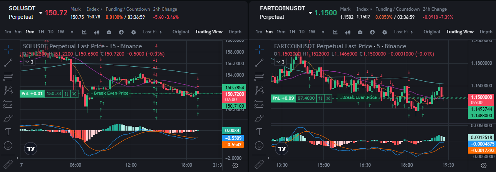

## MACDHISTHIST
monitor histogram of macd -> look for stange chage
hist negative -> position : close short, open long
hist positive -> negative : close long, open short

### 

### ❌ Weaknesses

- Sideways Market : false entries, frequent position flipping

### Potential Improvements
- add condition only open position only stange aling with macd 
    * hist negative -> position and macd < 0  : close short, open long
    * hist positive -> negative and macd >= 0 : close long, open short

- 