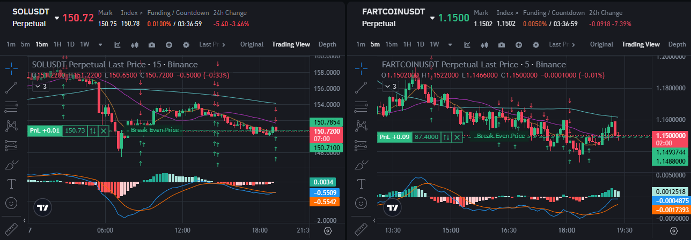

## MACDHIST
monitor histogram of macd -> look for stange chage
hist negative -> position : close short, open long
hist positive -> negative : close long, open short

### ✅ Strength
- high velocity

### ❌ Weaknesses

- Sideways Market : false entries, frequent position flipping

### Potential Improvements
- add conditions only open position only stange aling with macd

conditions for entry
    * histogram negative -> position
    * macd > 0
    * marked_price > EMA 200
    * 2 consecutive increasing histogram (decide on 2)
    * all 4 conditions: close SHORT if any and open LONG position

    * histogram position -> negative
    * macd < 0
    * marked_price < EMA 200
    * 2 consecutive decreasing histogram
    * all 4 conditions: close LONG if any and open SHORT posistion

conditions for exit
    * histogram goes against position for 5 consecutive candle,  (deside on 5)
    * stage change from initial entry state.
    * either one of the 2 conditions is met, close position

- 